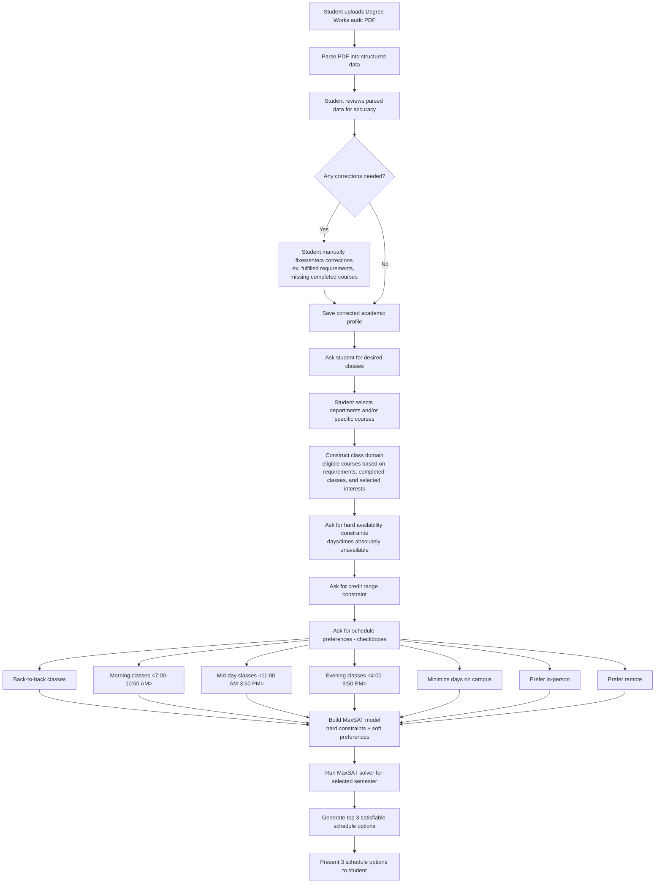

# Schedule Generation Flow

## Purpose
Describe the end-to-end flow for generating student schedules.

## Flow Diagram

## Step Details
1. Student uploads Degree Works PDF
2. Parse and review
3. Collect constraints/preferences
4. Run MaxSAT
5. Return top 3 schedules

## Inputs
- Degree audit PDF
- Student corrections
- Desired classes/departments
- Unavailable times
- Credit range
- Preferences

## Outputs
- 3 satisfiable schedule options for selected semester

## Open Questions
